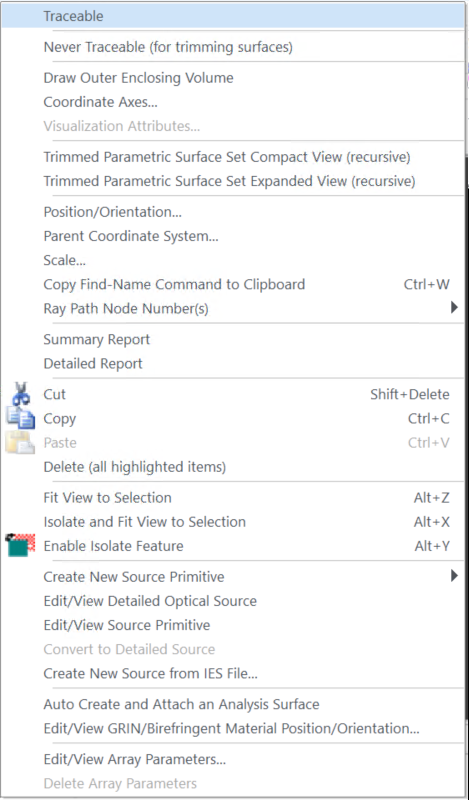
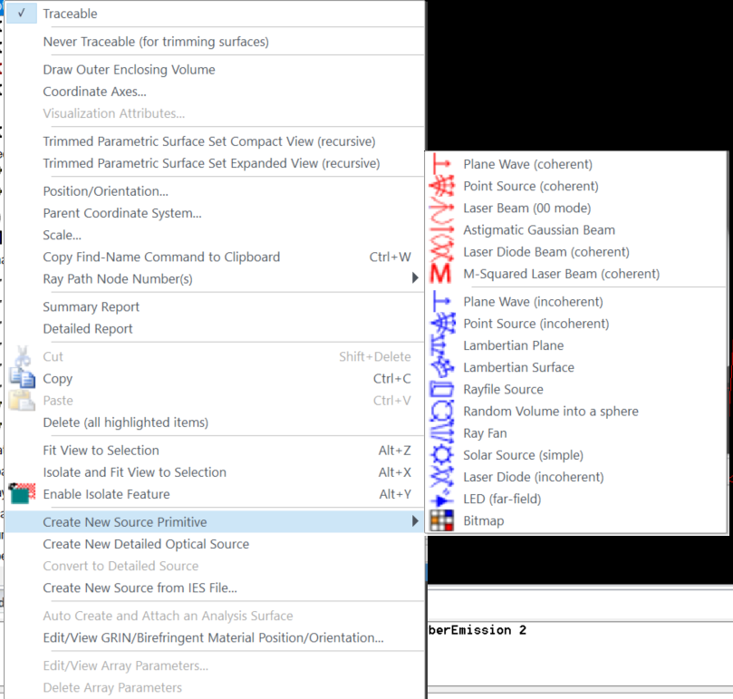
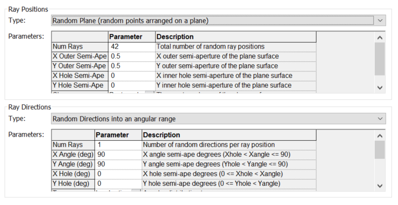
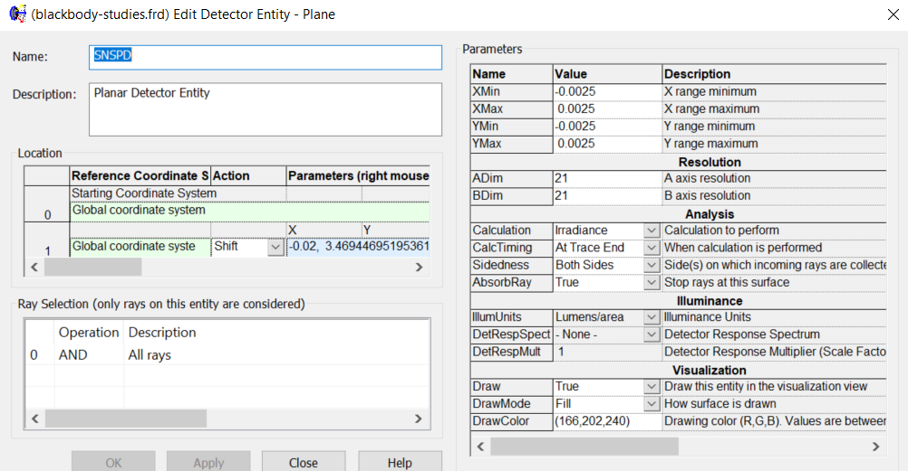
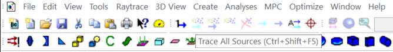
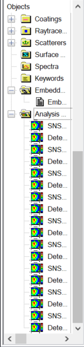

# InfraBREAD Blackbody Calibration Studies
## by Shardul Rao, Summer 2024 SULI Intern
This guide is intended for future students working on BREAD who want to get familiar with FRED and/or the Python scripts in this repo. If you have any questions, please feel free to reach out to me at `shardulr2931@gmail.com`!

## Using FRED
This video was very helpful in getting started with FRED as a complete newcomer: https://www.youtube.com/watch?v=MK6PzxAqCx8&ab_channel=DIY-Optics.

Much of my work this summer was done in the file `blackbody-studies.frd`. The key objects used to conduct the calibration simulations are divided into three categories: Optical Source(s), Geometry, and Analysis Surface(s).

### Moving Objects in FRED

### Optical Sources
As the name implies, this category contains the light source objects. In general, objects in FRED can be added or removed from the simulation by right-clicking on the object's name in the left hand side menu and selecting `Traceable`.

#### Creating Blackbody Source
In order to create a new optical source, right-click on the `Optical Source(s)` header and hover over `Create New Source Primitive` or `Create New Detailed Optical Source`. When doing these blackbody simulations, I used a Detailed Optical Source.

WIthin the Detailed Optical Source menu, to mimic the blackbody absorber, navigate to the `Positions/Directions` tab. Select `Random Plane` from the `Ray Position` dropdown menu and `Random Directions into an Angular Range` from the `Ray Direction` dropdown menu. In order to make the rays propagate down into the relector setup, scroll down to the bottom of the parameters under `Random Directions into an Angular Range` and change `(X, Y, Z) components of forward direction` to `(0, 0, -1)`. The Positions/Directions tab also lets you change the size of the optical source and the number of rays.

### Geometrical Objects
The linked video does a good job of covering geometrical objects. A lot of the properties should be fairly straightforward given the menus. Two important properties of geoemtrical objects are their `Coating` and `Raytrace Control`, both of which are found under `Edit/View Element Primitive (Solid) -> Optical Properties` or `Edit/View Surface -> Coating/Ray Control` depending on the geometrical entity. These two together are important to set properly in order to get expected behavior during raytracing.

### Analysis Surface Objects
Analysis surface objects are primarily used for counting the amount of rays that pass through themself. Analysis surface objects come in two forms: analysis surfaces (confusingly) and detectors. We found this summer that analysis surfaces can display strange behavior, registering ray counts even when no rays hit the surface. Therefore, I'd suggest to stick with detectors.

Like other objects, the traceability of detectors can be toggled. Right-clicking on the detector entity in the sidebar and selecting `Edit Analysis Entity` pulls up the following menu:

The parameters in the right-hand column are pretty self-explanatory, but are quite important. The `Resolution` section controls how many individual cells are present on the detector between the min and max values in x and y. Choosing an odd number in both A and B ensures that there is a detector cell whose center is also the detector's origin.

### Running a Ray Trace
After setting up optical sources, geometrical objects, and analysis surfaces, we can now conduct a ray trace. Running a single ray trace can be done in a couple of different ways. 

The easiest way to conduct a ray trace is from the toolbar at the top of the screen. The two buttons immediately beneath the `Create` tab are labelled `Trace All Sources` (with the dots and teal arrow) and `Trace and Render` (with the dots and dark blue arrow). The former conducts a ray trace without drawing out the individual rays (usually preferred for anything more than a handful of rays), while the latter also draws the rays on the screen. 
 

One advantage of a detector over an analysis surface is that upon the completion of a raytrace, a detector automatically saves the irradiance (by default) recorded on itself to an Analysis Results Node (ARN). These can be found on the bottom of the left-hand side menu under `Analysis Results`.

## Scripting in FRED

